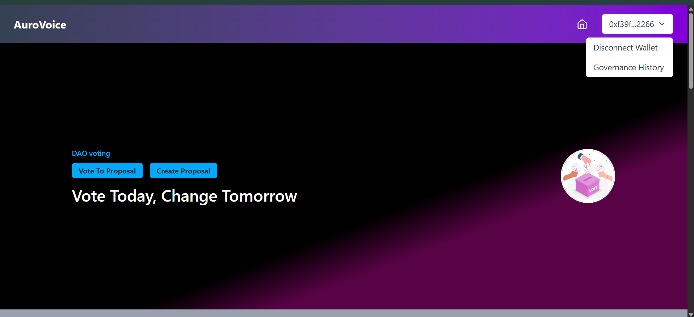
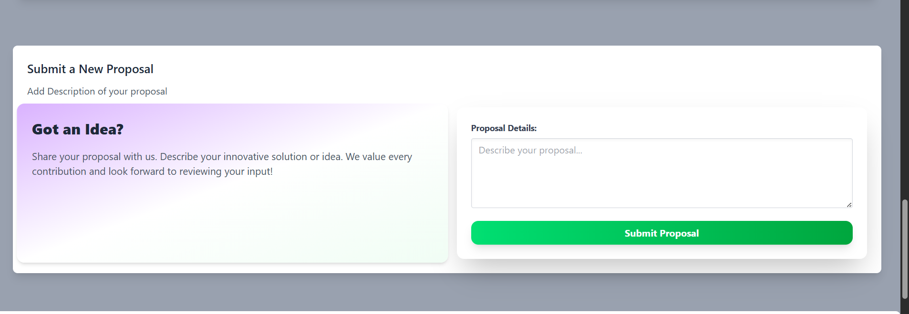
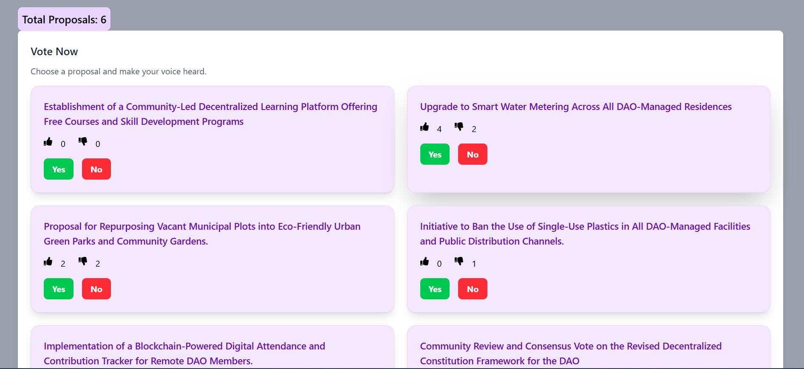
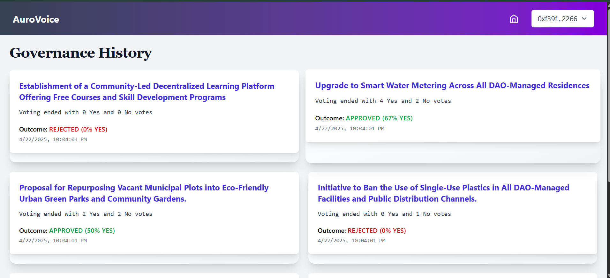
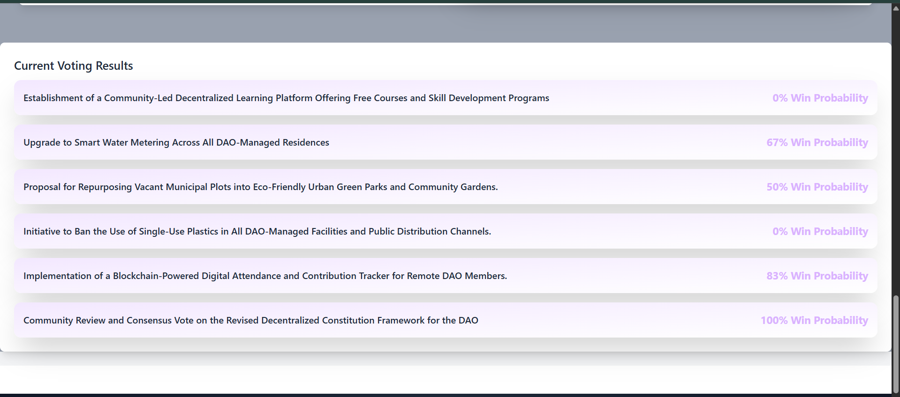

# 🗳️ AuroVoice: Next-Gen DAO Voting Platform

## 🔍 Project Summary

**AuroVoice** is a blockchain-powered decentralized voting system tailored for DAOs. This platform empowers users to submit proposals and vote on them seamlessly using their Ethereum wallets, fostering a transparent, trustless, and community-driven governance ecosystem.

🚀 With a sleek UI and real-time feedback, AuroVoice ensures user engagement, clarity, and secure decision-making.

---

## ✨ Key Features

| Feature                        | Description                                                                 | Status ✅ |
|-------------------------------|-----------------------------------------------------------------------------|----------|
| 📝 Proposal Creation          | Members can initiate new proposals with clear descriptions.                | ✅        |
| 👍👎 Like & Dislike Voting     | Cast votes using intuitive Like (👍) or Dislike (👎) icons.                  | ✅        |
| 📊 Live Vote Counts           | Displays updated voting results dynamically as votes come in.              | ✅        |
| 🧾 Governance Timeline        | View a chronological history of all proposals and their outcomes.          | ✅        |
| 🦾 Wallet-Based Access        | Only authenticated wallet users can submit or vote.                        | ✅        |
| 🧠 Enhanced UI/UX             | Smooth transitions, modern design, and responsive layout for all devices. | ✅        |

---

## 🖼️ Screenshots

  
*🔹 Modern homepage showing the current list of proposals.*

  
*🔹 Simple and clean interface to submit a proposal.*

  
*🔹 Cast your vote with Like 👍 or Dislike 👎 buttons.*

  
*🔹 Chronological view of proposal statuses and votes.*

  
*🔹 Live results display to track proposal progress.*

---

## ⚙️ Tech Stack

| Technology     | Purpose                                              |
|----------------|------------------------------------------------------|
| React.js       | UI development for frontend components               |
| Tailwind CSS   | Utility-first CSS for rapid styling                  |
| Solidity       | Smart contract development for Ethereum blockchain   |
| Hardhat        | Contract deployment & testing environment            |
| Ethers.js      | Blockchain interaction via JavaScript                |
| MetaMask       | Web3 wallet integration for user authentication      |

---

## 🚀 Getting Started

### 📦 Prerequisites

Make sure you have the following installed:

- [Node.js](https://nodejs.org/) (v16+)
- [npm](https://www.npmjs.com/) or [yarn](https://yarnpkg.com/)
- [Hardhat](https://hardhat.org/)
- [MetaMask](https://metamask.io/) browser extension

### 🛠️ Installation Steps

1. **Clone the repository**
   ```bash
   git clone https://github.com/Dharmendra2567/AuroVoice-DAO-voting-app-.git
   ```

2. **Install smart contract dependencies**
   ```bash
   cd dapp-contracts
   npm install
   ```

3. **Install frontend dependencies**
   ```bash
   cd ../dapp-frontend
   npm install
   ```

4. **Start the Hardhat local blockchain**
   ```bash
   cd dapp-contracts
   npx hardhat node
   ```

5. **Deploy smart contracts**
   ```bash
   npx hardhat deploy --network localhost
   ```

6. **Update frontend with contract addresses**
   - Open `dapp-frontend/src/blockchain.js`
   - Replace placeholder addresses with actual deployed contract addresses.

7. **Run the frontend app**
   ```bash
   cd ../dapp-frontend
   npm run dev
   ```

8. Open the app at: [http://localhost:5173/](http://localhost:5173/)

---

## 💡 Usage Guide

1. Open the app in your browser.
2. Connect your MetaMask wallet (ensure you're on the right network).
3. View the list of proposals or submit a new one.
4. Click 👍 or 👎 to vote.
5. Check the **Results** section to see how each proposal is doing.

---

## 📹 UI Enhancements & Animations

To enhance interactivity, consider adding:

- 🔄 Auto-refreshing proposal results
- 🧩 Custom icons for proposal categories
- 🗂️ Tag filters for proposal types
- 📈 Charts for vote statistics (e.g., pie/bar charts)

---

## 🙌 Contribution & Support

Feel free to contribute by raising issues or submitting pull requests. For feature requests, open a discussion or contact the maintainer.

📧 Email: deardharmendra.2567@gmail.com  

---

> “A transparent system is a trusted system. Let your voice be counted – securely.”  
> – Dharmendra Sah
